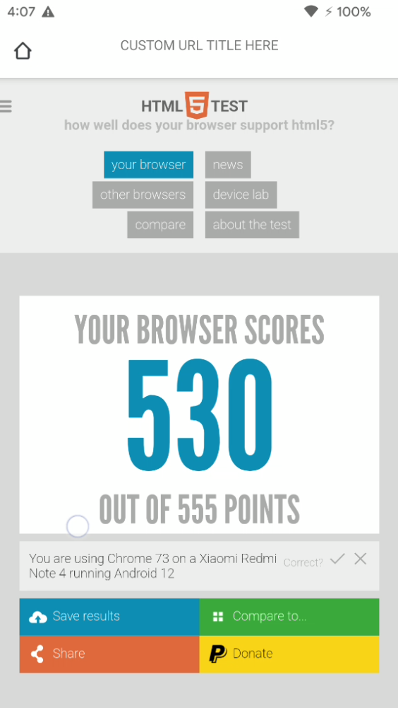

# Kodium
A chromium based web browser Customised in a way to behave like trusted web activity without using it

##### :warning: Bypassing Google Trusted Web Activity (TWA) and Custom Chrome Tabs (CCT)  in Android.
###### No need to Sign Digital Assest Certificate to Get the in-App Webview 

## Features
- Handles WebRTC with all the permissions you will ever need. (Tested on Android 12)
- Replace the Trusted Web Activity (TWA) in android
- Uses the Chromium JavaScript V8 engine to natively run all your java script code on the android device
- Get the Feel of running the entered url in the Native Web View of the android (But it's actually running on Chromium Browser)
- Get options to customise the UI ToolBar according to your app entirely
- Return to your app activity just by Pressing the back funtions and also by clicking on the image view of the chrome tab. 
## Demerits
- Increased app size approx (50 MB min.)
- You tell me :)

Info : All my App Code is in the kodiumCode Package.

### Code Debug

- Change the activities defined in the manifest from **lauchmode not to be single task**
- **ChromeActivity.java** (Role in navigation back to your app activity upon back press in chromium browser)
`Line 2050 onBackpressed() - add 
Intent chromeIntent = new Intent(getApplicationContext(), SplashActivity.class);
        startActivity(chromeIntent);`
Here SplashActivity.class is your app activity. Please comment rest of the code in the onBackpressed.
- Next, is the opening of the Default url everytime, Go to **WebAppActivity** :
_Step 1_ : Line 828 >> `Intent intent = new Intent(Intent.ACTION_VIEW, Uri.parse("PASTE_YOUR_URL_HERE"));`
_Step 2_ : Go to LoadParamsUrl.java Line 57,58>> `public LoadUrlParams(String url) {
        this("PASTE_YOUR_URL_HERE", PageTransition.LINK);
    }`
_Step 3_ : Go to LoadParamsUrl.java Line 67 `mUrl = "PASTE_YOUR_URL_HERE";
- Last Major Step is to Integerate the Custom ToolBar According to our choice and Remove all the Options
Go to **toolbar_phone.xml** << checkout the nested LinearLayout used to hide other options of the search bar.
Navigation to Custom App Activity >> **ToolbarPhone.java** Line 532 >> `  if (mHomeButton != null && mHomeButton == v) {`<< Write the Custom Intent Code to Launch your custom App Activity
- _Step 4:_ In order to remove the default chrome Accept Terms and Conditions screen and also the sign up screen.
  **FirstRunActivity.java** Line 215,216.
- _Step 5_ : Display the Back to App Icon always in the Chrome Custom Toolbar **ToolbarPhone.java** set Visibility to VISIBLE in the ``removeHomeButton()`` ``addHomeButton()`` Methods.

You are done implementing a chrome inApp Webview Without the Help of the Trusted Web Activity or even the Custom Chrome Tabs

### Results.

<table>
  <tr>
     <td>Kodium HTML 5 Score Test</td>
   </tr>
  <tr>
    <td></td>
  </tr>
 </table>

